# manifold

An **atlas of computed mathematics** — interactive math illustrations, statically hosted on
GitHub Pages and built with TypeScript + Vite. Computational-terminal styling (Manifold design
system): monospace-forward, dark/light with a phosphor accent.

Live: **[manifold.tamino.dev](https://manifold.tamino.dev)**

## Illustrations

| Preview | Illustration | Description |
| :-----: | ------------ | ----------- |
| <a href="https://manifold.tamino.dev/chessboard/">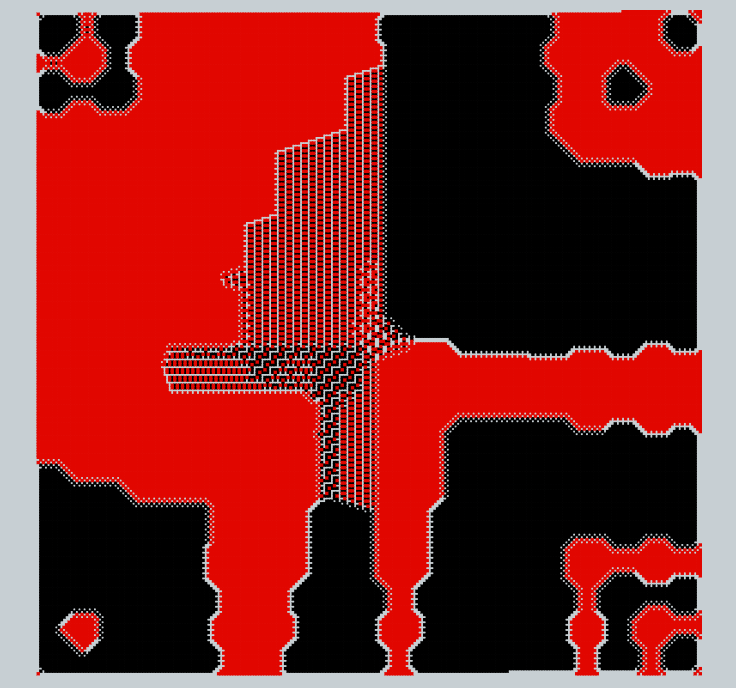</a> | **[Chessboard Patterns](https://manifold.tamino.dev/chessboard/)** | Pieces drop onto a counter-clockwise number spiral, each taking the lowest-indexed cell no opposing piece attacks. Accelerating, smoothly-zooming fill (cell&nbsp;1 stays centered); scrub the timeline, and configure pieces — colour, movement grid (29 symmetric presets), weight — and round-robin / weighted placement. Scales to **1,000,000** pieces, computed in a Web Worker with a progress bar so the UI never freezes. |
| <a href="https://manifold.tamino.dev/hilbert/">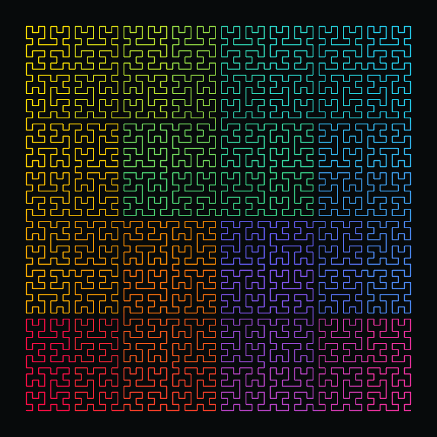</a> | **[Hilbert Curve](https://manifold.tamino.dev/hilbert/)** | A single continuous, non-crossing path that fills a 2<sup>k</sup>&nbsp;×&nbsp;2<sup>k</sup> grid while keeping 1-D-close indices 2-D-close — **locality made visible**. Step the order through k&nbsp;=&nbsp;1..9 (the curve recursively quadruples), scrub the draw along the path, and choose a spectral **gradient-along-path** (a smooth 1-D rainbow that stays smooth in 2-D — no long-range colour jumps) or a clean **solid** line. Generated synchronously up to **262,144** points. |
| <a href="https://manifold.tamino.dev/goldbach/">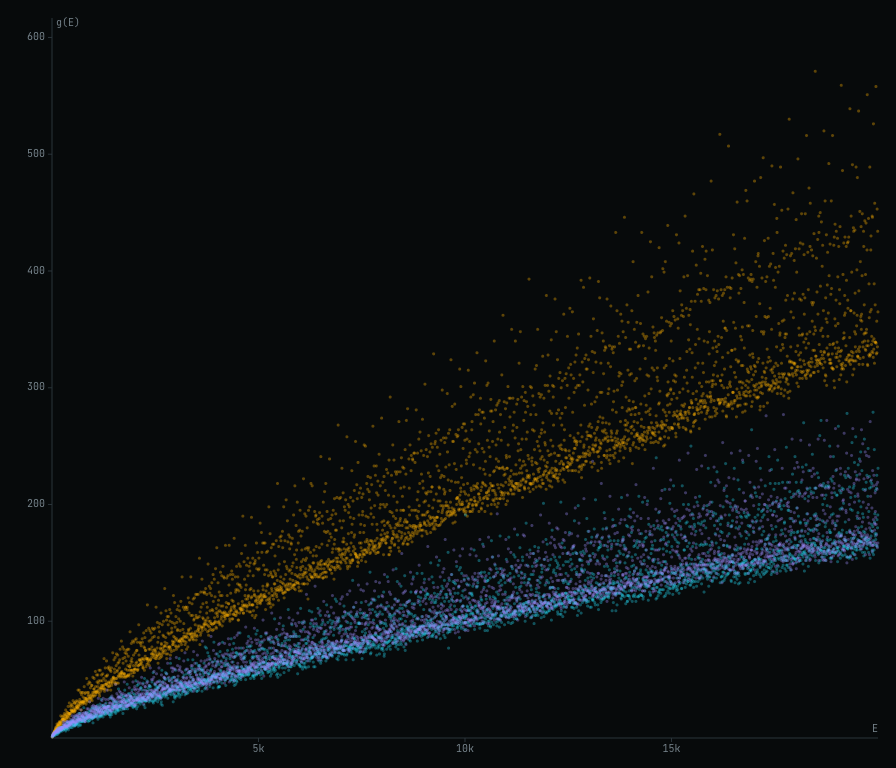</a> | **[Goldbach's Comet](https://manifold.tamino.dev/goldbach/)** | Every even number `E` scattered against `g(E)` — how many ways it splits into two primes ([OEIS&nbsp;A045917](https://oeis.org/A045917)). Low-alpha dots accumulate into the glowing comet whose lower edge **never reaches zero** (Goldbach made visible). Sweep the reveal left→right, colour by band (`E mod 6` / `3 | E`) to expose the sub-bands, and tune point size/alpha. Scales to **200,000**, computed synchronously up to 50k and in a Web Worker beyond. |
| <a href="https://manifold.tamino.dev/pascal/">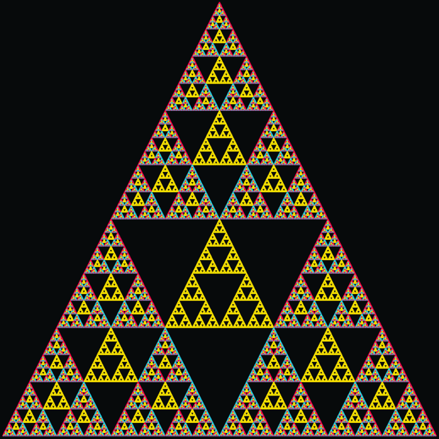</a> | **[Pascal's Triangle mod n](https://manifold.tamino.dev/pascal/)** | Color each cell of Pascal's triangle by its binomial coefficient **mod m**. At **m&nbsp;=&nbsp;2** the lit cells are exactly the **Sierpinski gasket** (the odd entries, [A047999](https://oeis.org/A047999)); drag the modulus slider and the lattice morphs live between clean nested triangles (primes) and richer composites. Color cells by residue hue, or by **prime / non-prime** or **perfect / non-perfect** class (each a color family shaded by value); residue values fade in at high zoom. Apex-centered camera grows the reveal downward; prime _m_ uses Lucas' theorem per visible cell for free deep zoom, composite _m_ a packed row-build cache. |
| <a href="https://manifold.tamino.dev/ulam/">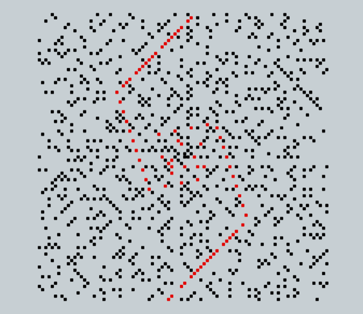</a> | **[Ulam / Prime Spiral](https://manifold.tamino.dev/ulam/)** | The integers wind onto the same counter-clockwise spiral and every prime lights up (black), resolving into the famous diagonal streaks. Mark a second class in red over the field — twin primes, Euler's `n²+n+41`, any custom `a·n²+b·n+c`, or non-prime classes like perfect squares and triangular numbers that trace the spiral's geometry. Scrub the reveal (integer labels auto-appear when you zoom in) and explore up to **10,000,000**, sieved synchronously up to 250k and in a Web Worker beyond. |
| <a href="https://manifold.tamino.dev/dragon/">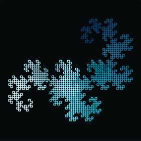</a> | **[Dragon Curve](https://manifold.tamino.dev/dragon/)** | The Heighway dragon, walked directly from the paper-folding turn rule ([OEIS&nbsp;A014577](https://oeis.org/A014577)) — no string rewriting. Two animations: **iteration** continuously grows the curve through orders k&nbsp;=&nbsp;1..18 (each order doubles the detail, revealed as a smooth unfurling prefix), and **fold-morph** sweeps the crease angle 0°→90° so the flat strip folds in place into the dragon. **Position-gradient** colouring exposes the two self-similar halves, and an optional **4-copy** tiling shows the four rotated dragons interlocking — each its own position-shaded hue. Both themes, HiDPI; strokes up to **262,144** segments. |
| <a href="https://manifold.tamino.dev/toothpicks/">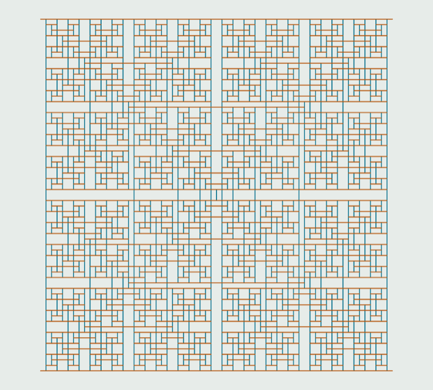</a> | **[Toothpick Patterns](https://manifold.tamino.dev/toothpicks/)** | Toothpicks sprout at every exposed endpoint, generation by generation, building OEIS&nbsp;[A139250](https://oeis.org/A139250)'s fractal sieve. Growth is pure docking-point logic — each shape is an in-dock plus the out-docks it emits — so you pick which shapes exist and the round-by-round order they're added (colour + weight each, round-robin / weighted), and the structure grows as concentric colour-coded rings. Smoothly-zooming timeline, step one generation at a time, computed in a Web Worker with a progress bar. |
| <a href="https://manifold.tamino.dev/ford-circles/">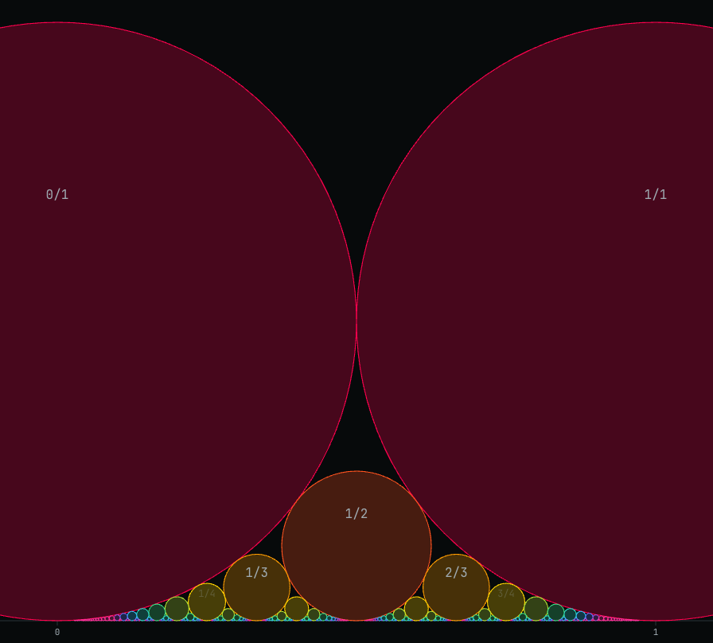</a> | **[Ford Circles / Farey](https://manifold.tamino.dev/ford-circles/)** | Every reduced fraction `p/q` becomes a circle resting on the number line at `x = p/q` with radius `1/(2q²)`; neighbours in a Farey sequence kiss (`\|a·d − b·c\| = 1`) but never overlap. An equal-scale camera keeps the circles perfectly **round**; wheel-zoom and drag-pan into the endlessly nested fractal of tangent circles. Reveal densifies as the order&nbsp;`n` (max denominator) climbs; colour by **denominator** or **Stern–Brocot depth**, fill or outline, with LOD fraction labels at high zoom. |
| <a href="https://manifold.tamino.dev/prime-spiral/">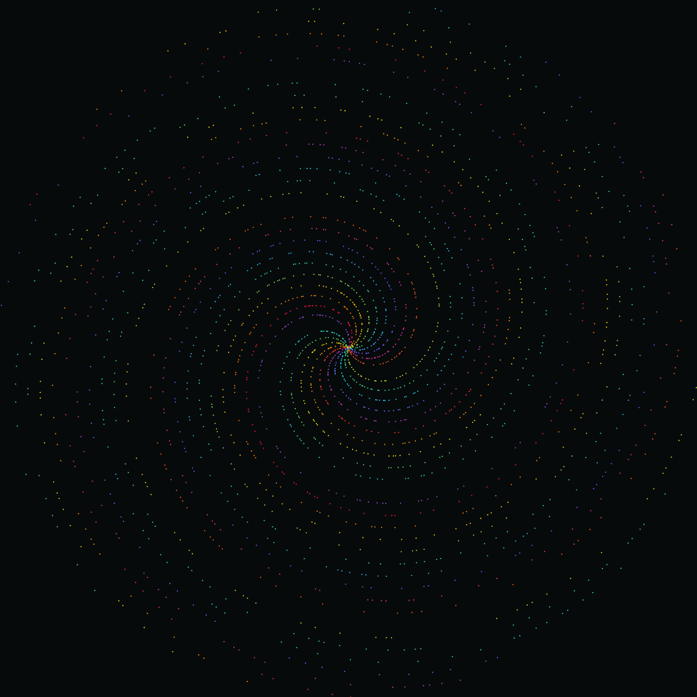</a> | **[Prime Spiral (Polar)](https://manifold.tamino.dev/prime-spiral/)** | Every prime plotted at polar `(r=n, θ=n radians)`; zoom out and the points snap into ~6, then ~44 Archimedean spiral arms — the rational approximations `6/1, 44/7, …` of 2π. Colour by residue with a modulus slider (2–64, marked at 44) to paint each arm a single hue (Dirichlet's theorem made visible); scrub the reveal, overlay the full integer lattice, and tune dot size. Scales to **1,000,000**, sieved in a Web Worker with a progress bar so the UI never freezes. |
| <a href="https://manifold.tamino.dev/collatz/">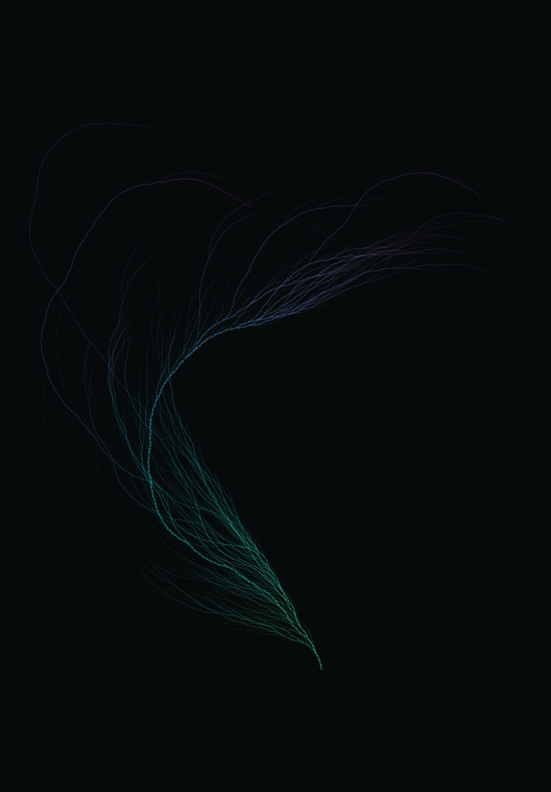</a> | **[Collatz Coral](https://manifold.tamino.dev/collatz/)** | Thousands of 3n+1 trajectories grown from a shared root into one organic branching tree. The trajectories are deduped into the shared **Collatz tree**, so each edge is drawn once and weighted by how many seeds flow through it — bright, thick trunks; faint, thin tips. Two turn-angle knobs (θ&nbsp;even / θ&nbsp;odd) morph it live between a tight fern and a sprawling coral, with a **length-variance** knob for a hand-grown look; the camera fits the revealed extent and eases back as it grows. Scrub the ring-by-ring depth reveal, solid or depth-gradient colour. Scales to **50,000** seeds, rebuilt synchronously on every change. |
| <a href="https://manifold.tamino.dev/recaman/">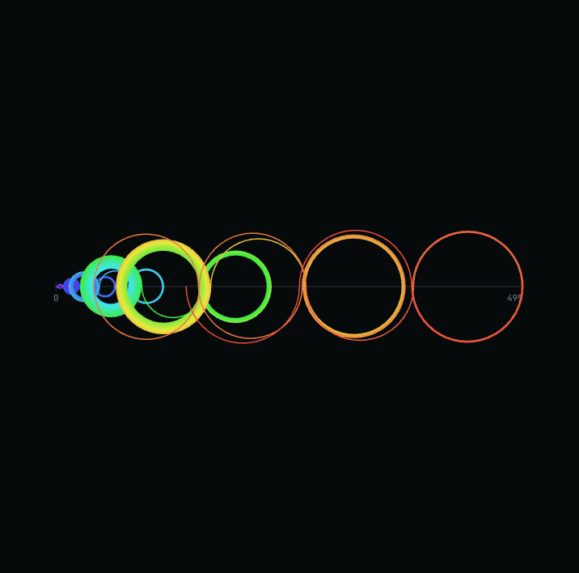</a> | **[Recamán's Sequence](https://manifold.tamino.dev/recaman/)** | Alternating up/down semicircular arcs along a number line trace Recamán's sequence ([OEIS&nbsp;A005132](https://oeis.org/A005132)) into its iconic non-crossing web. Scrub the timeline to reveal arcs one at a time while a bounding-box camera keeps the growing line framed; play/pause/step and a speed control drive the reveal. Toggle **gradient-by-n** vs **single-accent** colouring and alternating vs all-above sides, and dial **terms** up to **100,000**. |
| <a href="https://manifold.tamino.dev/langtons-ant/">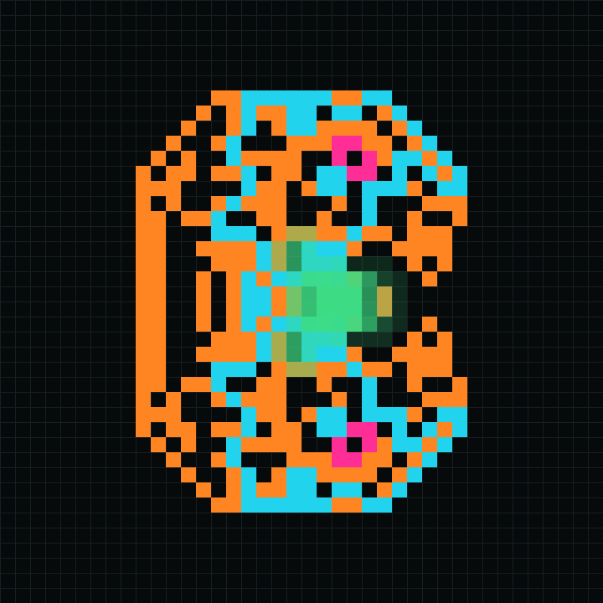</a> | **[Langton's Ant](https://manifold.tamino.dev/langtons-ant/)** | One ant follows two turn-and-flip rules on a blank grid: ~10,000 steps of apparent chaos, then it locks into a periodic 104-step "highway" to infinity. Fast-forward through the chaos (exponential speed up to **5,000** steps/frame) and watch order crystallise live, or jump ahead **+10K / +100K / +1M** steps at a time. Follow-ant / fit-region cameras, an optional comet trail, a live **STEP / BLACK** readout matching [OEIS&nbsp;A255938](https://oeis.org/A255938), and turmite rule strings (`RL`, `RLR`, `LLRR`, free text over `L R U N`). |
| <a href="https://manifold.tamino.dev/go/">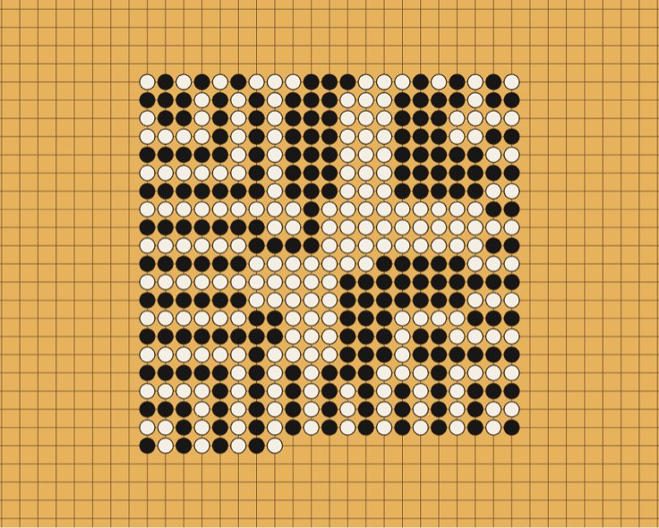</a> | **[Go Patterns](https://manifold.tamino.dev/go/)** | Stones fill the counter-clockwise number spiral, each color taking the lowest-numbered cell where a **legal Go move** lands — no suicide (unless it captures), positional superko, 4-neighbour liberties on an infinite board. Captures **remove** stones and reopen low cells, so the fill churns and backfills into an organic, marbled, eye-holed territory map. Configure the repeating **turn-order pattern** (`black, white` by default; add colors for more players, or `black, black, white` to let a color play more often). Continuous LOD on a bright goban: outlined circles on a lined board → flat discs → squares. Worker-computed to **1,000,000** moves. |

## Theme

Dark and light are both first-class and **auto-selected from the OS** (`prefers-color-scheme`),
with a manual toggle (persisted) in the header.

## Development

```bash
npm install
npm run dev        # start the dev server
npm test           # run unit tests (Vitest)
npm run lint       # Biome lint + format + import-order check
npm run typecheck  # tsc --noEmit
npm run build      # production build to dist/
```

## Deployment

Pushing to `main` triggers `.github/workflows/deploy.yml`, which lints, typechecks, tests, builds,
and deploys `dist/` to GitHub Pages. The custom domain is configured via `public/CNAME`
(`manifold.tamino.dev`).

**One-time setup:** in the repo's **Settings → Pages**, set **Source** to **GitHub Actions**, and
point the `manifold.tamino.dev` DNS record at GitHub Pages.

## Adding an illustration

1. Create `src/illustrations/<name>/` with a `main.ts` and a `preview.ts`.
2. Add `<name>/index.html` at the repo root and register it as an input in `vite.config.ts`.
3. Add an entry to `src/gallery/registry.ts`.
4. Drop a preview image in `docs/previews/<name>.png` and add a row to the Illustrations table above.

The Manifold design tokens live in `src/styles/manifold/` — link `styles.css` and use the CSS
custom properties (`--accent`, `--surface`, `--font-mono`, the `.ds-label`/`.ds-grid-bg`/`.ds-dot-bg`
utilities, etc.) so new pages inherit the theme automatically.
